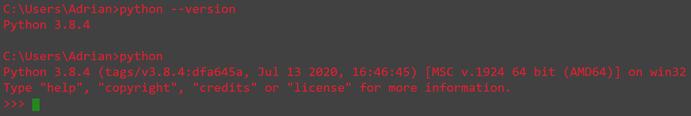

# Python-Data-Structures

## Fundamental data structures based on the Python language

## Table of contents
* [General info](#general-info)
* [Technologies](#technologies)
* [Setup](#setup)

## General info
A data structure is a particular way storing and organizing data in a computer for efficient access and modification.

The data structures can be [linear](https://github.com/Adri-md-1208/Python-Data-Structures/tree/master/Linear%20Structures) or [non-linear](https://github.com/Adri-md-1208/Python-Data-Structures/tree/master/Non%20Linear%20Structures) depending on the way it stores the data. The python language also have some [predefined data structures](https://github.com/Adri-md-1208/Python-Data-Structures/tree/master/Predefined%20Structures).

## Technologies
* Python: 3.8.4

You can also see your python version by typing in the command line:
````
python --version
```` 
or opening the python shell and check the version:



## Setup
Nothing for now.

### In progress
I am still building the repo.